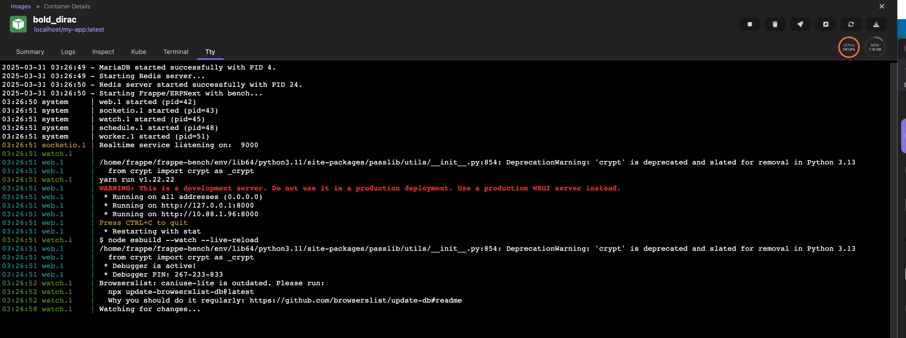

# Single Node Frappista



## What is Single Node Frappista?

**Single Node Frappista** provides pre-packaged, zero-configuration Docker images for the [Frappe Framework](https://frappeframework.com/) and [ERPNext](https://erpnext.com/). 

Instead of spending hours setting up MariaDB, Redis, Node, Python, and the Frappe Bench locally, you can pull one of these images and have a fully running, single-node Frappe/ERPNext environment instantly. It comes pre-installed with a site named `dev.localhost`.

These images are perfect for:
- Rapid local development
- CI/CD pipelines
- Quick product demonstrations

---

## 📦 Image Coordinates

All images are actively published to Docker Hub and are natively built for both **AMD64** (Intel/AMD) and **ARM64** (Apple Silicon/M1/M2/M3/M4).

| Application | Tag / Version | Image Name |
|-------------|---------------|------------|
| **Frappe** | `version-14` | `docker.io/vyogo/frappe:sne-version-14` |
| **Frappe** | `version-15` | `docker.io/vyogo/frappe:sne-version-15` |
| **Frappe** | `develop` | `docker.io/vyogo/frappe:sne-develop` |
| **ERPNext** | `version-14` | `docker.io/vyogo/erpnext:sne-version-14` |
| **ERPNext** | `version-15` | `docker.io/vyogo/erpnext:sne-version-15` |
| **ERPNext** | `develop` | `docker.io/vyogo/erpnext:sne-develop` |

*(Note: The `s2i-*` tags are internal builder images. For running the application, always use the `sne-*` (Single Node Environment) tags listed above).*

---

## 🚀 How to Run

Running your own Frappe/ERPNext environment is as simple as executing a single command. 

Ensure you have [Docker](https://www.docker.com/) or [Podman](https://podman.io/) installed, then run:

```bash
docker run -d \
  --name my-frappe-instance \
  -p 8080:8000 \
  docker.io/vyogo/erpnext:sne-version-15 \
  /usr/libexec/s2i/run
```

**Accessing the application:**
1. Wait a moment for the internal services (MariaDB, Redis, etc.) to start.
2. Open your browser and navigate to: `http://localhost:8080`
3. Login using the default credentials:
   - **Username:** `Administrator`
   - **Password:** `admin` (or `ChangeMe` depending on the build configuration)

---

## 🛠 Mounting Custom Apps (Development)

If you are developing a custom Frappe app, you don't need to rebuild the entire image every time you make a change. You can mount your local app directory directly into the container!

Assuming your custom app is located at `./my_custom_app`:

```bash
docker run -d \
  --name my-dev-bench \
  -p 8080:8000 \
  -v $(pwd)/my_custom_app:/home/frappe/frappe-bench/apps/my_custom_app \
  docker.io/vyogo/frappe:sne-version-15 \
  /usr/libexec/s2i/run
```

Once the container is running, you can install your app into the site:

```bash
# Exec into the container
docker exec -it my-dev-bench /bin/bash

# Install the app onto the default site
bench --site dev.localhost install-app my_custom_app
```

Now, any changes you make in your local `./my_custom_app` folder will immediately reflect in the running container!

---

## 📦 Native Packages (Snap, `.deb`, `.rpm`)

Prefer running Frappe directly on a Linux host instead of in a container? The
snap and native distribution packages are built from a separate repository:

**[vybench](https://github.com/vyogotech/vybench)** *(private)*

```bash
# Debian / Ubuntu
sudo apt install ./frappista_16.31.0-1~ubuntu2404_amd64.deb
sudo frappista-setup --site dev.localhost --admin-password admin

# any distribution with snapd
sudo snap install frappista --classic
sudo snap alias frappista.bench bench
```

> [!NOTE]
> That repository vendors this one's `upload/src/nginx/frappe.conf.template`, so
> the packages and the images route `/assets`, `/files` and `/socket.io`
> identically. Its CI fails if the copy drifts — **if you change the nginx
> template here, it needs picking up there.**

---

## 📖 Advanced: Technical Documentation & S2I Building

Are you looking to use Frappista as a base image to package your own apps for production, or want to understand how the Source-to-Image (S2I) build process works under the hood?

Please refer to our **[S2I Builder Technical Documentation](docs/s2i-builder.md)**.